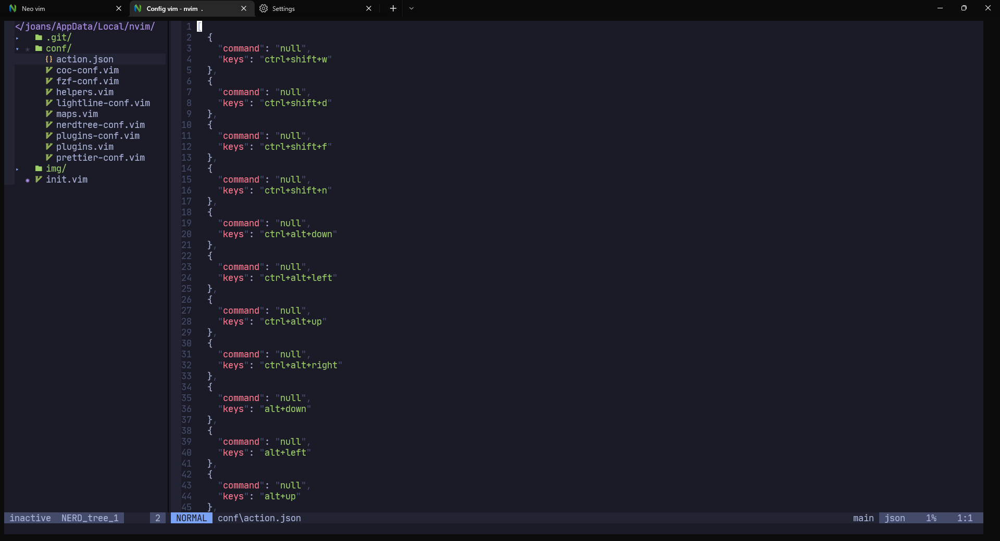

## Dependencies:

- [Vim-Plug](https://github.com/junegunn/vim-plug)

- [Fzf](https://github.com/junegunn/fzf.vim)

- [Ag](https://github.com/ggreer/the_silver_searcher)

- [Ripgrep](https://github.com/BurntSushi/ripgrep)

#### Install Typescript, Eslint and Prettier

```bash
npm install -g typescript typescript-language-server eslint prettier
```

## Install Plugins

use in vim

```bash
:PlugInstall
```

## EXTRA

If you use Windows Terminal in its settings.json it have ‘Actions’ key, you should changes to ‘Actions’ which is in the file `./conf/actions.json` , to avoid problems with the hootkey that’s defined 


